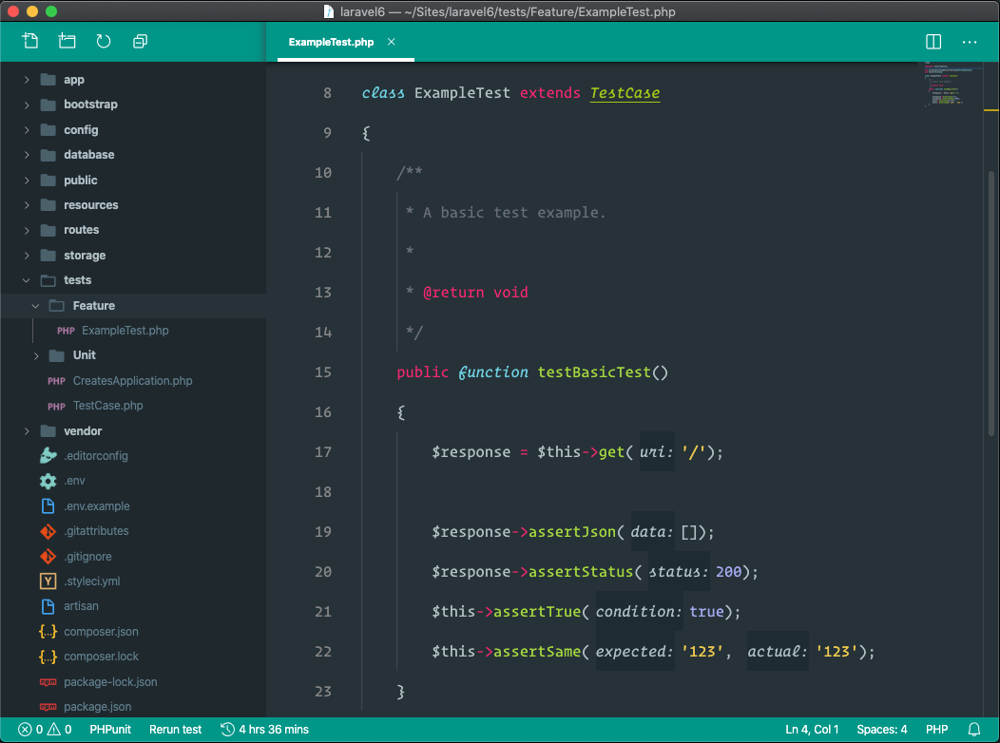

# PHP Parameter Annotations for Visual Studio Code

## Settings

There currently is a few configurable settings in the extension

| Name | Description | Default |
|-------|------------|---------|
| `phpannotations.enabled`  | Enable PHP Annotations | true |
| `phpannotations.margin` | Annotation styling of margin CSS property | 5 |
| `phpannotations.fontWeight` | Annotation styling of font-weight CSS property | "400" |
| `phpannotations.fontStyle` | Font style for annotations. | "italic" |
| `phpannotations.fontSize` | Font size for annotations. | 12 |

## Themable Colors

You can change the default foreground and background colors in the `workbench.colorCustomizations` property in user settings.

| Name | Description |
|------|-------------|
| `phpannotations.annotationForeground` | Specifies the foreground color for the annotations |
| `phpannotations.annotationBackground` | Specifies the background color for the annotations |
